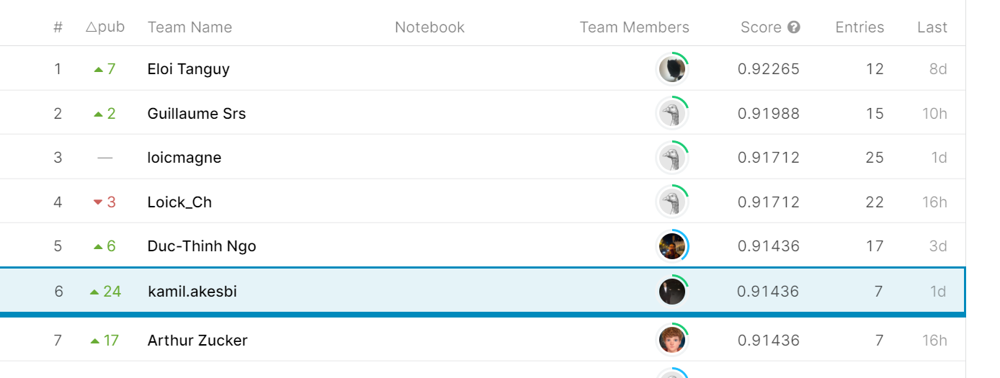

# MVA RecVis 2021 Bird image classification Kaggle competition

Link to the competition: [https://www.kaggle.com/competitions/mva-recvis-2021/leaderboard]

In this paper, I present the main approaches I tested during the MVA 2021 RecVis competition. The data set given
is a subset of the Caltech-UCSD Birds-200-2011 dataset.
It contains a training set, a validation set and a test set of
1087, 103, and 512 images. The goal is to develop the best
classification model to predict species of birds among 20
different classes. The dataset can downloaded [here](https://www.kaggle.com/competitions/mva-recvis-2021/data). 

I ranked 6th over 164 on the private leaderboard: 

## Data Processing: 

### Birds detection: 

I created a new data set containing only croped boxes of
detected birds for each image. This can help the classification model focus more on birds and less on non relevant
image parts. In order to do this, I used the detectron2
open source code published by FAIR. This package provide
multiple pretrained model on the COCO dataset that can
perform multiple tasks such as detection or segmentation
: [detectron2](https://github.com/facebookresearch/
detectron2/blob/main/MODEL_ZOO.md)

For this project, I used an instance segmentation model
(Mask R-CNN [3] with ResNeXt-101-32x8d) which
provide both bounding boxes and segmentation of detected
object with a good box average precision on COCO (44.3).
For each image, I croped the highest confident bird box and
enlarged it to get a square image. When no bird is detected,
the original image is kept and added to the new dataset.

### References: 