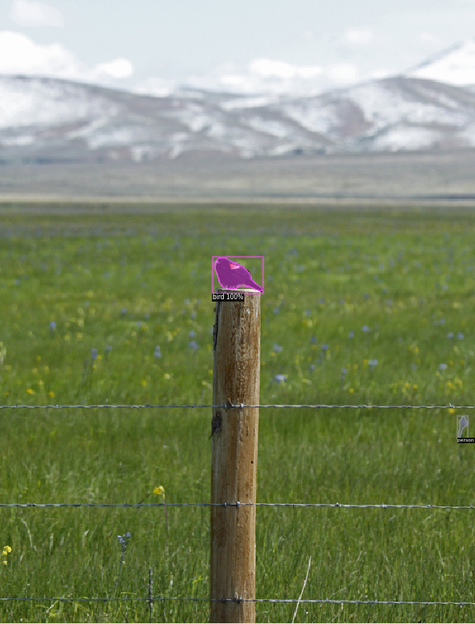
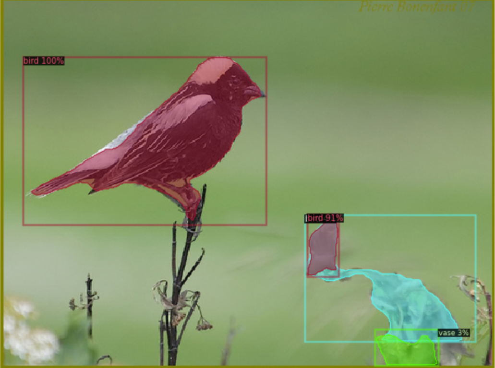
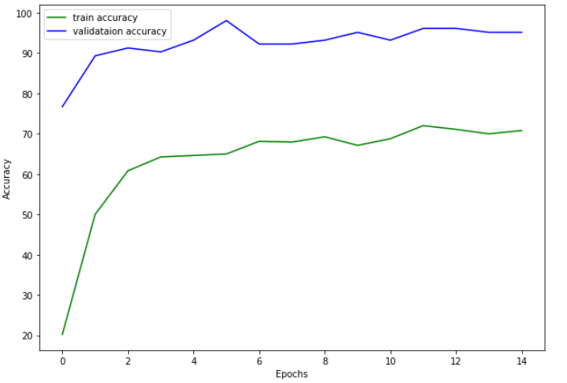

# MVA RecVis 2021 Bird image classification Kaggle competition

Link to the [competition](https://www.kaggle.com/competitions/mva-recvis-2021/leaderboard)

In this repository, I present the main approaches tested during the MVA 2021 RecVis competition. The data set given
is a subset of the Caltech-UCSD Birds-200-2011 dataset.
It contains a training set, a validation set and a test set of
1087, 103, and 512 images. The goal is to develop the best
classification model to predict species of birds among 20
different classes. The dataset can downloaded [here](https://www.kaggle.com/competitions/mva-recvis-2021/data). 

I ranked 6th out of 164 participants on the private leaderboard: 

## Data Processing: 

### Birds detection: 

I created a new data set containing only croped boxes of
detected birds for each image. This can help the classification model focus more on birds and less on non relevant
image parts. In order to do this, I used the detectron2
open source code published by FAIR. This package provide
multiple pretrained model on the COCO dataset that can
perform multiple tasks such as detection or segmentation
: [detectron2](https://github.com/facebookresearch/
detectron2/blob/main/MODEL_ZOO.md)

For this project, I used an instance segmentation model
(Mask R-CNN [3] with ResNeXt-101-32x8d) which
provide both bounding boxes and segmentation of detected
object with a good box average precision on COCO (44.3).
For each image, I croped the highest confident bird box and
enlarged it to get a square image. When no bird is detected,
the original image is kept and added to the new dataset.

### Data Augmentation: 

Data Augmentation can greatly improve the accuracy of
vision transformers fine-tunned models according to [4].
I added random Horizontal flip (0.4) and RandAugment
[1] to my data set during training. 

Finally, I resized the images to shape (384,384,3) so
that it could fit pretrained vision transformer models. 

## Model: 

Transfer-learning works well for small datasets : using
a pretrained model on a huge data set can help get much
complex image representations and build more performant
models. I first tried to fine tune pretrained ResNet and
EfficientNet with linear layers on top but I couldn’t get
over 0.77 accuracy score on the public leaderboard.

I finally tried various pretrained vision transformer
models from timm library https://github.com/
rwightman/pytorch-image-models to which I
added 3 linear layers whith dropout to limit overfitting. I
finally selected the vit base resnet50 384 model. Vision
Transformer have recently received a huge interest in the
Computer Vision community [2].

## Trainings and results: 

I trained the model for 30 epochs on training set and evaluated it on validation set. I used Adam Optimizer, cross
entropy criterion and early stopping (4 patience steps) in
order to limit overfitting. The model stoped training after
14 epochs because of EarlyStopping. It reached 0.87 accuracy on the public leaderboard.

### References: 

-  E. D. Cubuk, B. Zoph, J. Shlens, and Q. V. Le. Randaugment:
Practical data augmentation with no separate search. CoRR,
abs/1909.13719, 2019.
-  A. Dosovitskiy, L. Beyer, A. Kolesnikov, D. Weissenborn,
X. Zhai, T. Unterthiner, M. Dehghani, M. Minderer,
G. Heigold, S. Gelly, J. Uszkoreit, and N. Houlsby. An image
is worth 16x16 words: Transformers for image recognition at
scale. CoRR, abs/2010.11929, 2020.
- K. He, G. Gkioxari, P. Dollar, and R. B. Girshick. Mask R- ´
CNN. CoRR, abs/1703.06870, 2017.
- A. Steiner, A. Kolesnikov, X. Zhai, R. Wightman, J. Uszkoreit, and L. Beyer. How to train your vit? data, augmentation, and regularization in vision transformers. CoRR,
abs/2106.10270, 2021.